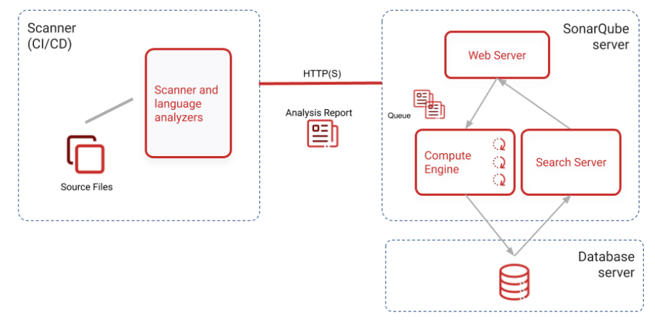
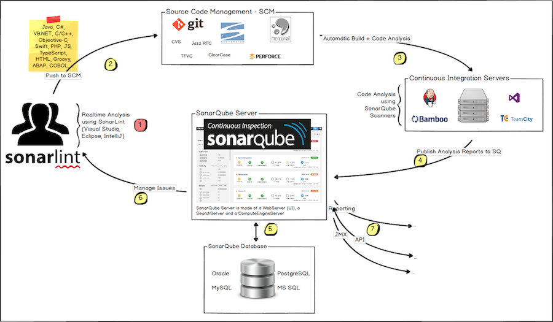

Developer / CI
     |
     |  (sonar-scanner)
     v
+--------------------+
|   SonarQube Server |
|  (Web + Compute)   |
+--------------------+
          |
          v
     +---------+
     |Database |
     |Postgres |
     +---------+





# SonarQube Setup & CI Integration Guide (Docker + Jenkins)

This document explains the **complete working process of SonarQube** using **Docker**, **PostgreSQL**, and **Jenkins CI**.  
The setup is production-aligned and suitable for **real DevOps pipelines**.

---

## 📌 What is SonarQube?

SonarQube is a **static code analysis platform** used to detect:
- Bugs
- Vulnerabilities
- Code smells
- Security issues
- Technical debt

It enforces **quality gates** during CI to decide whether a build should pass or fail.

---

## 🧠 SonarQube Architecture

SonarQube follows a **Server–Scanner architecture**.

```
Developer
|
v
Jenkins CI
|
| (Sonar Scanner / mvn sonar:sonar)
v
SonarQube Server (9000)
|
v
PostgreSQL Database
```


### Components

| Component | Description |
|---------|-------------|
| SonarQube Server | Web UI + analysis engine |
| PostgreSQL | Persistent storage for metrics |
| Sonar Scanner | Runs inside Jenkins |
| Jenkins | CI orchestrator |

---

## 🧾 System Requirements

### Minimum
- OS: Amazon Linux 2023 / Linux
- CPU: 2 vCPU
- RAM: 4 GB (8 GB recommended)
- Docker installed
- Open port **9000**

---

## ⚠️ Mandatory Kernel Configuration

SonarQube uses **Elasticsearch**, which requires:

```bash
vm.max_map_count = 262144
```

Apply permanently:
```
sysctl -w vm.max_map_count=262144
echo "vm.max_map_count=262144" >> /etc/sysctl.conf
```

## 🐳 SonarQube Installation (Docker)
### Step 1: Create Docker network
```
docker network create sonar-net
```

### Step 2: Run PostgreSQL (Required)
```
docker run -d \
  --name sonar-postgres \
  --network sonar-net \
  -e POSTGRES_USER=sonar \
  -e POSTGRES_PASSWORD=sonar \
  -e POSTGRES_DB=sonarqube \
  -v sonar_pg_data:/var/lib/postgresql/data \
  postgres:15
```

### Step 3: Run SonarQube (LTS)
```
docker run -d \
  --name sonarqube \
  --network sonar-net \
  -p 9000:9000 \
  --restart unless-stopped \
  -e SONAR_JDBC_URL=jdbc:postgresql://sonar-postgres:5432/sonarqube \
  -e SONAR_JDBC_USERNAME=sonar \
  -e SONAR_JDBC_PASSWORD=sonar \
  -v sonarqube_data:/opt/sonarqube/data \
  -v sonarqube_extensions:/opt/sonarqube/extensions \
  -v sonarqube_logs:/opt/sonarqube/logs \
  sonarqube:lts-community
```

### Step 4: Verify Startup
```
docker logs -f sonarqube
```

Wait until you see:
```
SonarQube is up
```

Access UI:
```
http://<EC2-PUBLIC-IP>:9000
```

Default login:
```
admin / admin
```

(Change password on first login)


---
## 🔐 Generate SonarQube Token (For Jenkins)

1. Login to SonarQube

2. Go to My Account → Security
3. Generate token  
   - Name: jenkins-token
4. Copy the token (shown only once)

### 🔑 Add Token to Jenkins

Jenkins → Manage Jenkins → Credentials

- Kind: ``Secret Text``
- ID: ```sonar-token```
- Secret: ``<PASTE TOKEN>``

### 🔄 Jenkins ↔ SonarQube Flow
```
Jenkins Pipeline
   |
   | mvn sonar:sonar
   v
SonarQube Server
   |
   v
PostgreSQL
   |
   v
Quality Gate
   |
   v
Build PASS / FAIL
```

### Example Maven Sonar Command
```
mvn sonar:sonar \
  -Dsonar.projectKey=spring-petclinic \
  -Dsonar.host.url=http://<SONAR-IP>:9000 \
  -Dsonar.login=$SONAR_TOKEN
```